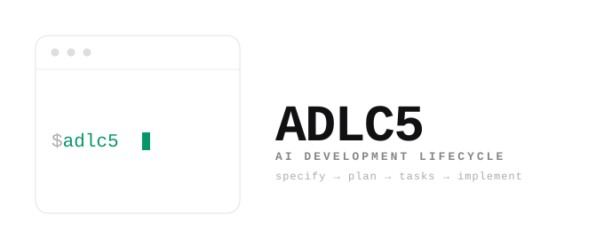

<picture>
  <source media="(prefers-color-scheme: dark)" srcset="assets/brand/logo-dark.svg">
  <source media="(prefers-color-scheme: light)" srcset="assets/brand/logo-light.svg">
  
</picture>

**AI Development Lifecycle (ADLC5 4.x)** — an evidence-driven development skill for agent-driven software: Specify → Plan → Tasks → Implement, with clear `@adlc5-*` handles from idea to production-ready code.

Framework and persisted-state versions are separate: ADLC5 4.x intentionally retains `schema_version: "3.0"` for state compatibility. The five core lifecycle skills plus cross-cutting SOUL track `core/VERSION`; auxiliary skills version independently.

- **Judgment + kernel** — Skills orchestrate discovery, design, and craftsmanship; a fat deterministic kernel (`./scripts/adlc5` + MCP) owns gates, state, clarity, packs, and model resolve. A2A is optional later — **not** the kernel.
- **Craftsmanship, not a syllabus** — Architecture, patterns (OKF catalog on demand), algorithms, and readable code raise the bar without textbook branding.
- **Clarity before code** — Thorough `ask_only` discovery and a solid plan make later stages more deterministic and cheaper in tokens.
- **SOUL, the fifth pillar** — Five guards now reason over the 4.0 work graph: preserve consumer acceptance, select the minimum sufficient profile, honor dependency/file ownership, demand independent evidence, and optimize cost only after quality. Advisory; gates stay the enforcement.
- **Lean context, many hosts** — Packs, progressive catalog, and Context7/MCP for live docs; multi-IDE Agent Plugins plus install/upgrade hygiene that prune stale host links.
- **Pressure-tested** — [`dogfood/`](dogfood/) and `pr-ready` are proof points among the rest of the system — not the whole pitch.

## Install

One distribution tree at the repo root (`core/`, `skills/`, `scripts/`, …). Version: [`core/VERSION`](core/VERSION).

```bash
git clone https://github.com/dango85/adlc5.git && cd adlc5
cp config.example.yaml config.yaml
./scripts/install.sh --platform all   # or: cursor | claude | codex | opencode | gemini | hermes | antigravity
./scripts/verify-install.sh
```

**Cursor Agent Plugin:** load [`.cursor-plugin/plugin.json`](.cursor-plugin/plugin.json) (skills + kernel/MCP shims). Classic `install.sh` still symlinks skills/rules for all seven hosts.

In your **application repo**:

```bash
/path/to/adlc5/scripts/init-workspace.sh --project .
/path/to/adlc5/scripts/init-feature.sh --feature my-feature --interaction hitl
@adlc5 for my-feature
```

Workspace initialization creates a tracked `.agents/` repository constitution and
a generated, gitignored `.agent-cache/` structural index before feature SDD starts.
See [repository context](core/guides/repository-context.md).

### Upgrade / clean old installs

`install.sh` and `update-adlc5.sh` treat **`core/VERSION`** as source of truth. On install they:

1. Print current version and `ADLC5_ROOT`
2. **Prune stale skill/rule symlinks** (old forge/v1 names, broken links, legacy `v1/skills` and `v2/skills` targets, retired ADLC5 `.mdc` rule links) and **aged install backups** (opt out with `--keep-backup`) via `cleanup-stale-skills.sh`
3. Backup-replace existing install targets, then re-link current `skills/`
4. Verify kernel + MCP + plugin metadata

Feature folders under `.adlc5/{feature}/` are **not** auto-pruned.

```bash
./scripts/update-adlc5.sh --self      # this host
./scripts/update-adlc5.sh --global    # all hosts
./scripts/cleanup-stale-skills.sh --platform all --prune-stale-skills --prune-stale-rules
./scripts/cleanup-features.sh --workspace . --status complete --older-than 90 --dry-run
./scripts/cleanup-features.sh --workspace . --status complete --older-than 90 --archive
# Archive also writes OKF Feature summary + usage summary:
#   .adlc5/_archive/{feature}-YYYYMMDD/FEATURE.md (includes a Usage section)
#   .adlc5/_archive/{feature}-YYYYMMDD/usage-summary.json (when usage was recorded)
```

If an old clone still has a `v2/` layout, pull/rebase onto 4.x (paths lift to root) or re-clone, then re-run `install.sh`.

## Four-stage handles

| Invoke | Stage |
|--------|--------|
| `@adlc5` | Full lifecycle orchestrator |
| `@adlc5-specify` | Specify |
| `@adlc5-plan` | Plan |
| `@adlc5-tasks` | Tasks |
| `@adlc5-implement` | Implement → `pr-ready` |

Skill index: [shared/docs/SKILL-MAP.md](shared/docs/SKILL-MAP.md)

## Supported hosts

Cursor · Claude Code · Codex · OpenCode · Gemini CLI · Hermes Agent · Antigravity — [CROSS-PLATFORM.md](shared/docs/CROSS-PLATFORM.md)

## Knowledge base vs live docs (MCP)

The [in-repo knowledge base](shared/docs/knowledge-base/) is **timeless craftsmanship** — design judgment that does not churn with release cycles. Book-depth essays live there as reference, not as the product brand.

For **current** libraries, frameworks, APIs, agentic protocols, and up-to-date best practices, enable **Context7 MCP** (and your other configured MCPs — e.g. wiki / Obsidian for institutional knowledge). That is part of getting full value from ADLC5 setup; do not treat the vendored KB as a live library docs store. Agents must revalidate volatile claims against official sources and follow [current-information.md](core/guides/current-information.md) before using or shipping them.

**OKF pattern catalog** (`shared/docs/patterns/`): progressive disclosure — lookup ids with `./scripts/adlc5 patterns lookup`, open ≤3 cards per turn; never paste the full catalog into development cycles.

Agent retrieval order: [mcp-knowledge-retrieval](.cursor/rules/mcp-knowledge-retrieval.mdc) · install notes: [INSTALL.md](shared/docs/INSTALL.md)

## Docs

| Doc | Contents |
|-----|----------|
| [shared/docs/INSTALL.md](shared/docs/INSTALL.md) | Install, workspace, agent self-update |
| [shared/docs/SKILL-MAP.md](shared/docs/SKILL-MAP.md) | Skill invoke index |
| [docs/ADLC5.md](docs/ADLC5.md) | Lifecycle reference |
| [docs/ADLC5-kernel.md](docs/ADLC5-kernel.md) | Fat kernel + MCP |
| [core/guides/repository-context.md](core/guides/repository-context.md) | Repository constitution and generated intelligence |
| [AGENTS.md](AGENTS.md) | Agent invoke map |
| [STRUCTURE.md](STRUCTURE.md) | Repository layout |
| [CHANGELOG.md](CHANGELOG.md) | Release notes |

[LICENSE](LICENSE)
