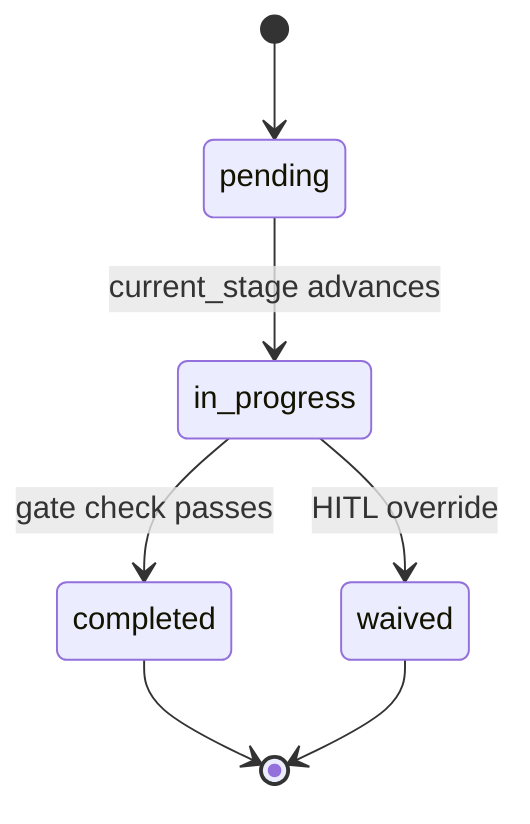

# ADLC5 — SDD Model

**Canonical lifecycle:** Specify → Plan → Tasks → Implement

Single unified state at `.adlc5/{feature}/state.json` (`schema_version: "3.0"`).

## Stage status lifecycle

`stage_status.{specify,plan,tasks,implement}` transitions only via the paths below — [`check-gates.py`](../scripts/check-gates.py) drives `completed`, HITL drives `waived`; nothing sets a stage `completed` by direct write:

## Core stages

| Stage | `current_stage` | Purpose | Exit gate |
|-------|-----------------|---------|-----------|
| **Specify** | `specify` | Requirements, AC, scale NFRs, git isolation | `specify-complete` |
| **Plan** | `plan` | Engineering + design (architecture, patterns, design docs) | `plan-complete` |
| **Tasks** | `tasks` | Story decomposition + TDD code specs | `tasks-complete` |
| **Implement** | `implement` | Build → verify → integrate → QA → PR | `pr-ready` |

## Step ladder

### Specify

| Step ID | Label |
|---------|-------|
| `specify-0-git` | Git isolation |
| `specify-1-discover` | Problem discovery (optional) |
| `specify-2-requirements` | Requirements (PRT) |
| `specify-3-nfr` | Scale NFR capture |
| `specify-4-handoff` | Spec handoff |

### Plan

| Step ID | Label |
|---------|-------|
| `plan-1-engineering-architecture` | Clean architecture review |
| `plan-2-engineering-patterns` | Pattern selection |
| `plan-3-engineering-algorithms` | Algorithm review (if scale NFRs) |
| `plan-4-design-discovery` | Design discovery |
| `plan-5-design-contracts` | API & integration contracts |
| `plan-6-design-operations` | Security, performance, ops |
| `plan-7-design-critique` | Design critic verdict (gate) |

### Tasks

| Step ID | Label |
|---------|-------|
| `tasks-1-stories` | User stories + parallel batches |
| `tasks-2-code-spec` | TDD code specs (tests before code) |

### Implement

| Step ID | Label |
|---------|-------|
| `implement-1-build` | TDD implementation |
| `implement-2-verify` | Story verification |
| `implement-3-integrate` | Integration & E2E |
| `implement-4-qa` | QA clearance |
| `implement-5-pr` | PR review |

## Auxiliary capabilities

Invoked on demand; not separate lifecycle stages.

| Capability | When |
|------------|------|
| `@discover`, `@prt` | Specify |
| `@autoresearch` | Plan (algorithm/perf uncertainty) |
| S1–S5 craftsmanship | Plan / Implement |
| `@build-implementer`, `@assure-verifier`, `@adlc5-assure-reworker` | Implement subagents |
| `@qa`, `@pr-reviewer` | Implement substeps |
| `@adlc5-project-wiki` | Promotion after `stage_status.implement: completed` |
| `@infra` | Post-Plan IaC authoring/validation (baseline for `@qa`) |
| `@deploy` | Post-merge deployment orchestration — `deploy-ready` gate, always HITL |
| Git orchestration scripts | Specify + parallel Implement |
| Memory compaction scripts | Every stage gate |
| Podman dev runtime | Implement local dev |
| Cloud runner | Headless autopilot |

## Context layers

| Layer | Path |
|-------|------|
| L0 State | `.adlc5/{feature}/state.json` |
| L1 Index | `.adlc5/{feature}/memory/INDEX.md`, summaries, context-packs |
| L2 Artifacts | `design/`, `tasks/code-spec/`, source |

Orchestrators read INDEX + active summary only. Subagents read generated context packs.

## Autopilot

`@adlc5` includes autopilot when `autopilot.mode: autonomous` or `policies.yaml` profile set.

Cost-aware profiles: `tiny`, `standard`, `high_risk`. Older
`small_feature`, `epic`, `research_spike`, and `custom` values remain valid and
retain the full canonical path unless their policy explicitly says otherwise.
See `templates/policies-{tiny,small-feature,high-risk}.yaml.example`.

Alternate gate IDs in older `state.json` files normalize via `core/gates.yaml` `legacy_aliases` on read.
