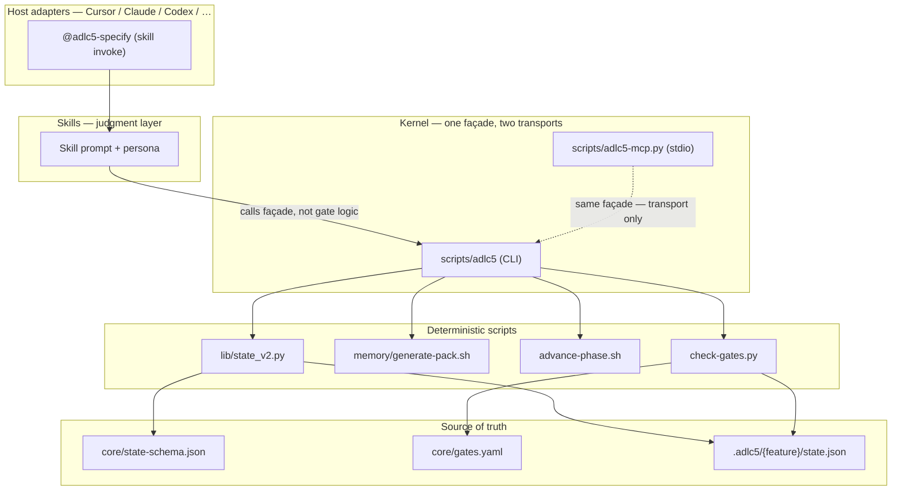
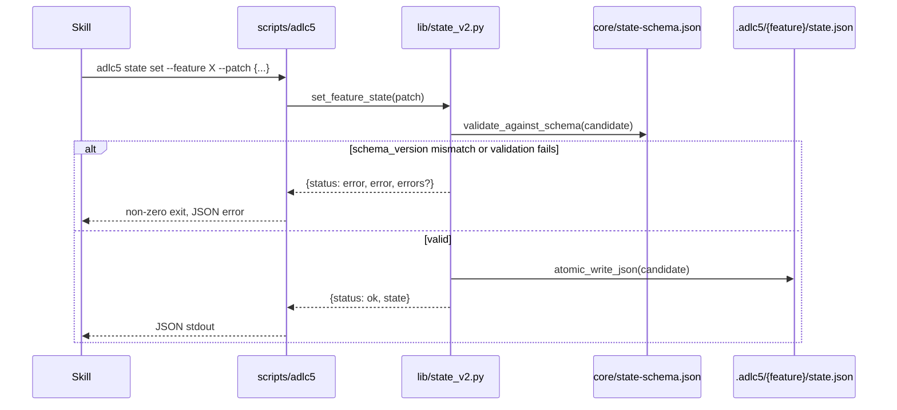

# ADLC5 — Evidence-Driven Fat Kernel (4.x)

**Version:** [`core/VERSION`](../core/VERSION) · **Paths:** repo root (`core/`, `skills/`, `scripts/`, …) — single 4.x tree

## Principles

1. **Kernel owns deterministic work** — phase legality, gates, clarity, packs/budget, state mutations, pilot control, model-tier resolve.
2. **Skills/LLM only when the kernel says judgment is required** — orchestration + prose, not gate logic.
3. **Scripts over skill logic** — façade calls existing scripts; MCP wraps the same façade (transport only).
4. **Packs not corpora** — story packs + budget; chat is ephemeral.
5. **Ponytail = Build rule**, not a skill.
6. **A2A optional later** — not the kernel.

## Evidence

What each principle above resolves to on disk, so the strategy is checkable, not asserted:

| Principle | Enforcing mechanism |
|-----------|----------------------|
| Deterministic gates | [`check-gates.py`](../scripts/check-gates.py) evaluates the boolean `checks:` list per gate in [`core/gates.yaml`](../core/gates.yaml) — no LLM call in the pass/fail path |
| One engine, two transports | `scripts/adlc5-mcp.py --smoke` and the CLI both resolve to the same façade calls; parity asserted in [`scripts/tests/run-all.sh`](../scripts/tests/run-all.sh) |
| Schema-locked state | Every `state set` validates against [`core/state-schema.json`](../core/state-schema.json) and refuses to write on a `schema_version` mismatch ([`scripts/lib/state_v2.py`](../scripts/lib/state_v2.py) `schema_version_locked`) |
| Atomic writes | `state_v2.py` `atomic_write_json` writes to a temp file and `os.replace`s — no torn/partial `state.json` on crash |
| Auditability (opt-in) | Gate scripts emit JSONL to `.adlc5/{feature}/telemetry/events.jsonl` — see [telemetry.md](telemetry.md) |

## Architecture



## Call path

`adlc5 state set` end to end — the invariant that keeps `state.json` from drifting out of schema:



## Layers

| Layer | Owns |
|-------|------|
| **Kernel** (`scripts/adlc5` + scripts) | Deterministic ops, JSON stdout, exit codes |
| **MCP** (`scripts/adlc5-mcp.py`) | Stdio transport → same façade (no second engine) |
| **Skills** | Judgment when kernel signals; call façade/scripts |
| **Host adapters** | Cursor/Claude/… install + spawn |

## CLI

| Command | Delegates to |
|---------|----------------|
| `adlc5 gate` | `scripts/check-gates.py` |
| `adlc5 pack` | `scripts/memory/generate-pack.sh` |
| `adlc5 clarity` | `scripts/clarity-score.py` |
| `adlc5 phase` | `scripts/advance-phase.sh` (suggest-only; no apply) |
| `adlc5 pilot` | `scripts/pilot-autopilot.sh` |
| `adlc5 state get` | read `.adlc5/{feature}/state.json` |
| `adlc5 state set` | merge/replace + validate `core/state-schema.json` + atomic write |
| `adlc5 repo-spec init\|reconcile\|validate` | `scripts/repository-context.py` (tracked constitution under `.agents/`) |
| `adlc5 repo-index build\|refresh\|check` | `scripts/repository-context.py` (gitignored intelligence) |
| `adlc5 resolve-model` | `scripts/resolve-model.sh` |
| `adlc5 patterns lookup` | `scripts/patterns/lookup.sh` (OKF ids/paths only) |
| `adlc5 cleanup-features` | `scripts/cleanup-features.sh` (dry-run archive → `_archive/`; `--delete` permanent; archive writes OKF `FEATURE.md`) |
| `adlc5 feature summarize` | `scripts/memory/summarize-feature-okf.py` (OKF Feature card from feature tree) |
| `adlc5 usage record` | `scripts/memory/usage-ledger.py record` (append model/token usage entry) |
| `adlc5 usage summary` | `scripts/memory/usage-ledger.py summary` (aggregate ledger by model/stage/token type + estimated `cost_usd` from `core/model-prices.yaml`) |
| `adlc5 spec-lint` | `scripts/tasks/spec-lint.py` (lint code-spec YAML frontmatter — backs `tasks-2-code-spec-complete`) |
| `adlc5 verify-story` | `scripts/verify-story.py` (deterministic per-story pre-check — feeds `implement-2-verify` additively when a story has frontmatter) |
| `adlc5 version` | `core/VERSION` |

Run: `./scripts/adlc5 --help`

`usage record` accepts optional `--run-id`, `--node-id`,
`--parent-node-ids`, `--attempt`, `--outcome`, and `--finding-id` fields. Join
those entries with telemetry and consumer-owned results using
`scripts/evaluate-runs.py`; see [evaluation.md](evaluation.md).

**Phase apply:** `advance-phase.sh` does not mutate state. Confirm with `phase`, then apply via `state set --patch`.

## MCP (stdio)

```bash
python3 ./scripts/adlc5-mcp.py          # stdio server
python3 ./scripts/adlc5-mcp.py --smoke  # tool list + version invoke
./.cursor-plugin/run-mcp.sh --smoke     # plugin shim (sets ADLC5_ROOT)
```

Tools (all shell `./scripts/adlc5`): `adlc5_version`, `adlc5_gate`, `adlc5_pack`, `adlc5_clarity`, `adlc5_phase`, `adlc5_pilot`, `adlc5_state_get`, `adlc5_state_set`, `adlc5_repo_spec`, `adlc5_repo_index`, `adlc5_resolve_model`.

## Agent Plugin packaging

| Host | Manifest | Notes |
|------|----------|-------|
| Cursor | [`.cursor-plugin/plugin.json`](../.cursor-plugin/plugin.json) | skills `skills/`, MCP `.cursor-plugin/mcp.json`, shims `run-adlc5.sh` / `run-mcp.sh` |
| Codex | [`platform/codex-plugin/plugin.json`](../platform/codex-plugin/plugin.json) | metadata + `adlc5.kernel/mcp`; skills via `install.sh` |
| Antigravity | install stub `plugin.json` + `ADLC5_ROOT` file | skills linked under plugin; kernel stays in clone |

**Plugin load vs classic install:** see [`.cursor-plugin/README.md`](../.cursor-plugin/README.md). Classic `./scripts/install.sh` still symlinks skills/rules for all seven hosts; it prints `ADLC5_ROOT` so agents can find the kernel/MCP.

Manifest paths are relative with **no `..` traversal**. Runtime shims resolve the distribution root at invoke time.

## Discover facilitation

| Field | Default | Meaning |
|-------|---------|---------|
| `facilitation_mode` | `ask_only` | No unsolicited suggestions; `collaborative` may propose after asking |
| `assumption_policy` | `refuse` | No invented facts; `tagged` / `allow` only when explicit |
| `council_enabled` | (user pref) | Orthogonal — council vs solo |

## Checklist

### Done

- [x] Kernel façade + schema-validated `state set`
- [x] Thin MCP stdio server over façade
- [x] Smoke/parity tests in `scripts/tests/run-all.sh`
- [x] Spine skills cite façade
- [x] Discover `facilitation_mode` / `assumption_policy`
- [x] Plugin packaging: Cursor manifests + shims + README; Codex metadata; install prints `ADLC5_ROOT`; verify checks kernel/MCP/shims
- [x] `core/VERSION` on the 4.x line (no versioned parallel tree)

### Next

- [ ] Phase auto-apply only after a dedicated validated apply script exists
- [ ] Optional: publish/copy tree into `~/.cursor/plugins/local/adlc5` without changing seven-host install
- [ ] Full skill rewrites for judgment boundaries
- [ ] A2A (optional; not the kernel)
