# ADLC5

**Specify → Plan → Tasks → Implement** — SDD-first agent lifecycle.

```bash
./scripts/install.sh --platform cursor
./scripts/init-workspace.sh --project .   # consumer app repo
./scripts/init-feature.sh --feature my-feature --interaction hitl
@adlc5 for my-feature
```

## Why SDD-first

Not a style preference — each claim below points at the code that enforces it:

- **Gates are enforced code, not convention.** [`check-gates.py`](../scripts/check-gates.py) runs the discrete checks listed per gate in [`core/gates.yaml`](../core/gates.yaml) and returns a non-zero exit on failure — HITL warns, autonomous mode fails closed. A stage can't be marked done by an agent asserting it's done.
- **One state, one schema.** Every stage/skill reads and writes the same `.adlc5/{feature}/state.json`, schema-validated on every write ([`core/state-schema.json`](../core/state-schema.json) via [`scripts/lib/state_v2.py`](../scripts/lib/state_v2.py)) — orchestrator and subagents can't drift into disagreeing about lifecycle position.
- **Kernel/skill split.** Deterministic gate, state, and phase logic lives in scripts behind the `scripts/adlc5` façade; skills only exercise judgment when the kernel signals it's required. See [ADLC5-kernel.md](ADLC5-kernel.md) Principles.

## Flow

```mermaid
flowchart LR
    Start(["init-feature.sh"]) --> Specify
    Specify -- check-gates.py --> GateSpecify{{"specify-complete?"}}
    GateSpecify -- fail --> Specify
    GateSpecify -- pass --> Plan
    Plan -- check-gates.py --> GatePlan{{"plan-complete?"}}
    GatePlan -- fail --> Plan
    GatePlan -- pass --> Tasks
    Tasks -- check-gates.py --> GateTasks{{"tasks-complete?"}}
    GateTasks -- fail --> Tasks
    GateTasks -- pass --> Implement
    Implement -- check-gates.py --> GatePR{{"pr-ready?"}}
    GatePR -- fail --> Implement
    GatePR -- pass --> Merge(["PR merged"])
```



| Stage | Skill | Gate |
|-------|-------|------|
| Specify | `@adlc5-specify` | `specify-complete` |
| Plan | `@adlc5-plan` | `plan-complete` |
| Tasks | `@adlc5-tasks` | `tasks-complete` |
| Implement | `@adlc5-implement` | `pr-ready` |

**Fifth pillar — SOUL** (cross-cutting, not a stage): `@adlc5-soul` keeps the five guards but applies them to the 4.0 graph—preserve consumer-owned acceptance, choose the minimum sufficient profile, respect dependency/file ownership, require independent verification, and optimize cost only after the quality floor. Advisory only; deterministic gates remain the enforcement. Rule: [adlc5-soul.md](../shared/rules/portable/adlc5-soul.md) · Skill: [skills/adlc5-soul](../skills/adlc5-soul/SKILL.md)

State: `.adlc5/{feature}/state.json` (`schema_version: "3.0"`) — [state-schema.json](../core/state-schema.json) · Model: [sdd-model.md](../core/sdd-model.md)

Autonomous: `init-feature.sh --interaction autonomous` · navigator: `scripts/pilot-autopilot.sh` · local executor handoff: `scripts/runner/dispatch.sh` (`needs_executor` until a host adapter performs the action)

Gates: `./scripts/check-gates.py --feature NAME --gate pr-ready` · registry: [skill-registry.yaml](../core/skill-registry.yaml)

Before Implement, freeze acceptance definitions with `./scripts/adlc5 anchors lock --feature NAME`; the command atomically binds state and the local manifest to `refs/adlc5/anchors/NAME`. Verify and `pr-ready` detect ordinary worktree changes to the manifest, command definition, or file digest. Command execution remains runtime evidence—the manifest content-addresses its text, not its output.

**Trust boundary:** this is worktree-tamper detection, not protection from an actor with arbitrary Git-ref write access. These refs are local and are not transferred by ordinary clone/fetch/push. Use an external human signature or permission-separated approval system when the repository writer itself is adversarial.

Invokes: [shared/docs/SKILL-MAP.md](../shared/docs/SKILL-MAP.md) · Cross-platform: [CROSS-PLATFORM.md](../shared/docs/CROSS-PLATFORM.md)

Version: `core/VERSION` · Update: `./scripts/update-adlc5.sh --self` | `--global` — [INSTALL.md](../shared/docs/INSTALL.md) § Agent self-update

Model tiers: [model-matrix.md](../core/guides/model-matrix.md) · `./scripts/resolve-model.sh --tier <tier>`
