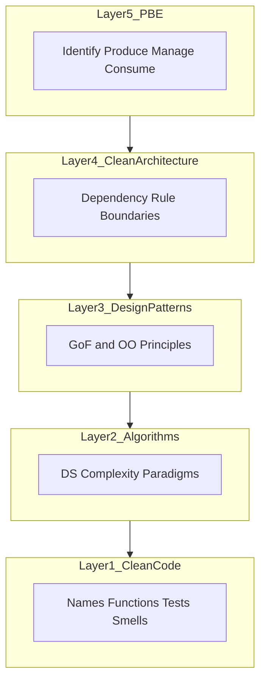

## 1. Executive summary

Great software from Cursor agents requires **five complementary disciplines**:

1. **PBE** — Treat recurring solutions as engineered assets (spec + implementation + lifecycle).
2. **Clean Architecture** — Dependencies point inward; frameworks and DBs are details.
3. **Design patterns (HFDP)** — Structure code for recurring *design* problems (Strategy, Observer, …).
4. **Algorithms (CLRS)** — Choose data structures and algorithms when scale and performance NFRs matter.
5. **Clean Code** — Make every unit readable, tested, and free of accumulating mess.

| Concept | Cursor artifact |
|---------|-----------------|
| Rules (specifications) | `.cursor/rules/*.mdc`, `AGENTS.md` |
| Skills (guided application) | `cursor-skills/*/SKILL.md`, `@skill` invoke |
| Hooks (automation) | `.cursor/hooks.json` |
| Pattern catalog (OKF) | `shared/docs/patterns/index.md` |
| This playbook | Stages, craftsmanship skills, knowledge base index |

**Current gap:** Strong pipeline skills (`@adlc5-plan`, `@prt`, `@pr-reviewer`, `@qa`) but thin **craftsmanship layer**—architecture review, pattern/algorithm selection, smell-based review, and PBE meta-workflows.

---

