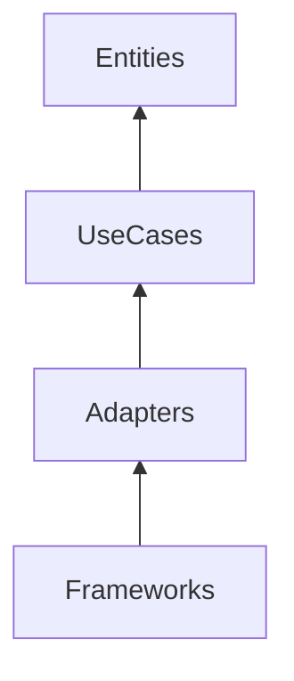

# Phase 3: Output — Clean Architecture Review

## Purpose

Deliver an architecture gate artifact for Plan sign-off or PR feedback.

## Output steps

### Step 1: Verdict

Apply criteria from SKILL.md — pass | pass-with-notes | fail.

### Step 2: Layer map table

Complete layer map from analysis with all scoped modules assigned.

### Step 3: Violations table

| Severity | Rule | Location | Fix |

Include dependency rule, leak type, or component principle violated.

### Step 4: Recommended boundaries

Propose:

- New ports (interfaces) needed
- Package moves
- Adapter extractions

Keep recommendations incremental for brownfield.

### Step 5: Optional diagram

Mermaid or ASCII showing inward dependency flow:

### Step 6: Gate checklist

Complete all four gate items from SKILL.md with explicit pass/fail per row.

### Step 7: Handoffs

List S3/S5/S3b follow-ups if boundaries need pattern or algorithm work.

Use [../templates/output-template.md](../templates/output-template.md).
